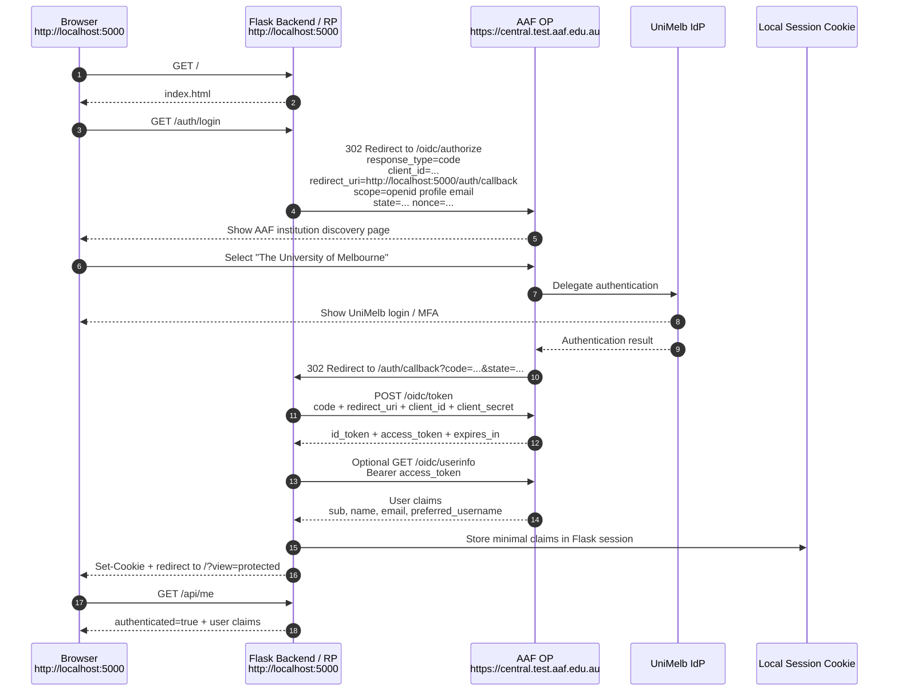

# AAF OIDC Local Demo

Minimal local proof of concept for signing in with AAF OpenID Connect and reading basic user claims through a Flask backend session.

## What It Shows

The browser opens `http://localhost:5000`, which is served by the Flask backend itself. From there it starts login through AAF and returns to the backend callback at:

```text
http://localhost:5000/auth/callback
```

The backend exchanges the authorization code for tokens, reads user claims, stores minimal claims in a Flask session cookie, then redirects the browser to the protected view.

Roles:

- RP / Client: this Flask backend
- OP: AAF Central
- IdP: University of Melbourne inside the AAF federation

The frontend never stores AAF tokens or the AAF client secret.

## Project Layout

```text
aai-aaf-python/
  backend/
    app.py
    pyproject.toml
    .env.example
    templates/
      index.html
```

## AAF Service Registration

refer [using-aaf-with-oidc](../../src/content/docs/guides/using-aaf-with-oidc.mdx)

## Local Configuration

Register the AAF client with this exact redirect URI:

```text
http://localhost:5000/auth/callback
```

Install `uv` before running the local Python commands. Backend dependencies are declared in `backend/pyproject.toml`; `uv` creates and manages the local environment on first run.

Create backend local config:

```bash
cd backend
cp .env.example .env
uv run python -c "import secrets; print(secrets.token_urlsafe(32))"
```

Fill in `backend/.env`:

```env
FLASK_SECRET_KEY=<generated-secret>
AAF_CLIENT_ID=<from-aaf>
AAF_CLIENT_SECRET=<from-aaf>
AAF_DISCOVERY_URL=https://central.test.aaf.edu.au/.well-known/openid-configuration
AAF_REDIRECT_URI=http://localhost:5000/auth/callback
```

Use the AAF test discovery URL first if the client was created in the test environment.

For production, register the service in production Federation Manager instead of the test manager, use production HTTPS URLs, and use the production discovery URL from the AAF client registration details.

## Run Locally

```bash
cd backend
uv run app.py
```

Open:

```text
http://localhost:5000
```

## AAF OIDC Localhost Login Flow



Important notes:

- RP / Client = our Flask backend.
- OP = AAF Central.
- IdP = University of Melbourne.
- The frontend never stores AAF tokens or the AAF client secret.
- The backend exchanges the authorization code for tokens.
- The backend creates a local session after successful OIDC login.
- Browser receives only our app's local session cookie.

## Backend Routes

- `GET /` serves the frontend HTML.
- `GET /auth/login` starts AAF OIDC login.
- `GET /auth/callback` handles the OIDC callback.
- `GET /api/me` returns session authentication state and claims.
- `GET /api/protected` returns protected data or `401`.
- `GET|POST /auth/logout` clears the local session.

## Security Notes

- Keep `.env` local and uncommitted.
- Do not put `AAF_CLIENT_SECRET` or AAF tokens in frontend code.
- This demo keeps `SESSION_COOKIE_SECURE=False` for local HTTP testing only.
- For production, use HTTPS, set secure cookies, and store secrets in a managed secret store such as AWS Secrets Manager, SSM Parameter Store, or Azure Key Vault.

## AAF References

- [OpenID Connect Series overview](https://tutorials.aaf.edu.au/openid-connect-series/01-overview)
- [Connect an OIDC Service overview](https://tutorials.aaf.edu.au/connect-an-oidc-service/01-overview)
- [Register an OIDC service](https://tutorials.aaf.edu.au/connect-an-oidc-service/02-connect-oidc-service)
- [Available scopes and eduGAIN](https://tutorials.aaf.edu.au/connect-an-oidc-service/03-available-scopes-and-edugain)
- [OpenID configuration](https://tutorials.aaf.edu.au/openid-connect-integration/03-openid-configuration)
- [OIDC attributes](https://tutorials.aaf.edu.au/openid-connect-integration/04-attributes)