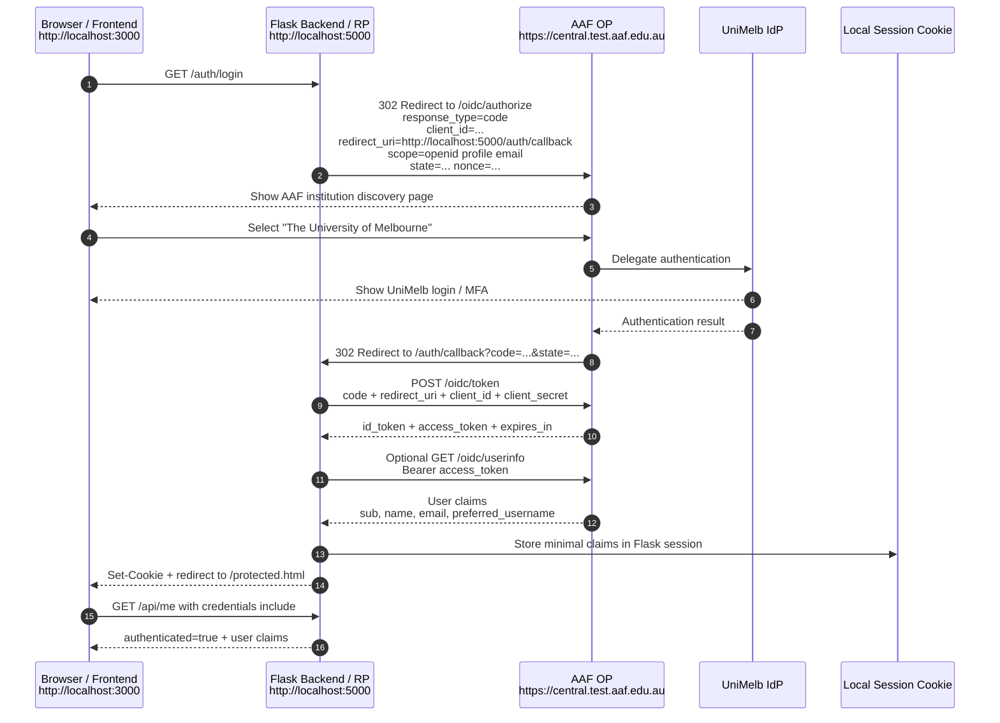

# AAF OIDC Local Demo

Minimal local proof of concept for signing in with AAF OpenID Connect and reading basic user claims through a Flask backend session.

## What It Shows

The browser opens a static frontend at `http://localhost:3000`, starts login through the Flask backend at `http://localhost:5000`, selects University of Melbourne in AAF institution discovery, and returns to the backend callback at:

```text
http://localhost:5000/auth/callback
```

The backend exchanges the authorization code for tokens, reads user claims, stores minimal claims in a Flask session cookie, then redirects the browser to `protected.html`.

Roles:

- RP / Client: this Flask backend
- OP: AAF Central
- IdP: University of Melbourne inside the AAF federation

The frontend never stores AAF tokens or the AAF client secret.

## Project Layout

```text
aai-aaf-python/
  backend/
    app.py
    requirements.txt
    .env.example
  frontend/
    index.html
    protected.html
    app.js
    styles.css
```

## AAF Service Registration

Use the AAF Test Federation first. The local demo is a server-side OIDC Relying Party, so the Flask backend is the registered client/service and keeps the client secret out of browser code.

Before you start, make sure you have AAF login access and can register a service for an AAF subscriber organisation.

1. Open [AAF Test Federation Manager](https://manager.test.aaf.edu.au/dashboard).
2. Sign in with your AAF account.
3. Choose **Connect a New Service**.
4. Choose **OpenID Connect**.
5. Complete the new service form:

```text
Name: AAF OIDC Local Demo
Description: Local Flask/static frontend demo for AAF OIDC login.
URL: http://localhost:3000/
Redirect URL: http://localhost:5000/auth/callback
Authentication Methods: Secret
Organisation: <your AAF subscriber organisation>
```

Field notes:

- `URL` is the primary app URL where users start login. For this demo, that is the static frontend.
- `Redirect URL` is the backend callback that receives the OIDC authorization response from AAF. It must match `AAF_REDIRECT_URI` exactly.
- Use `http` for localhost development URLs in the test environment.
- `Secret` is appropriate for this demo because the Flask backend can safely store the client secret.

6. Click **Register Service**.
7. Copy the generated **Identifier** and **Secret** immediately:

```text
Identifier -> AAF_CLIENT_ID
Secret     -> AAF_CLIENT_SECRET
```

The secret is only shown once. If it is lost, generate a new one in Federation Manager and update `backend/.env`.

8. Wait for the test federation registration to finish. AAF notes that new test services can take up to two hours before they are usable.
9. Check scopes for the service. This demo requests:

```text
openid profile email
```

Allow at least those scopes if the service page lets you restrict scopes. Extra claims are returned only when the user's home organisation provides the matching attributes. eduGAIN access is production-only and requires AAF support.

## Local Configuration

Register the AAF client with this exact redirect URI:

```text
http://localhost:5000/auth/callback
```

Create backend local config:

```bash
cd backend
python -m venv .venv
source .venv/bin/activate
pip install -r requirements.txt
cp .env.example .env
python -c "import secrets; print(secrets.token_urlsafe(32))"
```

Fill in `backend/.env`:

```env
FLASK_SECRET_KEY=<generated-secret>
AAF_CLIENT_ID=<from-aaf>
AAF_CLIENT_SECRET=<from-aaf>
AAF_DISCOVERY_URL=https://central.test.aaf.edu.au/.well-known/openid-configuration
AAF_REDIRECT_URI=http://localhost:5000/auth/callback
FRONTEND_URL=http://localhost:3000
```

Use the AAF test discovery URL first if the client was created in the test environment.

For production, register the service in production Federation Manager instead of the test manager, use production HTTPS URLs, and use the production discovery URL from the AAF client registration details.

## Run Locally

Terminal 1:

```bash
cd backend
source .venv/bin/activate
python app.py
```

Terminal 2:

```bash
cd frontend
python -m http.server 3000
```

Open:

```text
http://localhost:3000
```

## AAF OIDC Localhost Login Flow



Important notes:

- RP / Client = our Flask backend.
- OP = AAF Central.
- IdP = University of Melbourne.
- The frontend never stores AAF tokens or the AAF client secret.
- The backend exchanges the authorization code for tokens.
- The backend creates a local session after successful OIDC login.
- Browser receives only our app's local session cookie.

## Backend Routes

- `GET /` returns backend health JSON.
- `GET /auth/login` starts AAF OIDC login.
- `GET /auth/callback` handles the OIDC callback.
- `GET /api/me` returns session authentication state and claims.
- `GET /api/protected` returns protected data or `401`.
- `GET|POST /auth/logout` clears the local session.

## Security Notes

- Keep `.env` local and uncommitted.
- Do not put `AAF_CLIENT_SECRET` or AAF tokens in frontend code.
- This demo keeps `SESSION_COOKIE_SECURE=False` for local HTTP testing only.
- For production, use HTTPS, set secure cookies, and store secrets in a managed secret store such as AWS Secrets Manager, SSM Parameter Store, or Azure Key Vault.

## AAF References

- [OpenID Connect Series overview](https://tutorials.aaf.edu.au/openid-connect-series/01-overview)
- [Connect an OIDC Service overview](https://tutorials.aaf.edu.au/connect-an-oidc-service/01-overview)
- [Register an OIDC service](https://tutorials.aaf.edu.au/connect-an-oidc-service/02-connect-oidc-service)
- [Available scopes and eduGAIN](https://tutorials.aaf.edu.au/connect-an-oidc-service/03-available-scopes-and-edugain)
- [OpenID configuration](https://tutorials.aaf.edu.au/openid-connect-integration/03-openid-configuration)
- [OIDC attributes](https://tutorials.aaf.edu.au/openid-connect-integration/04-attributes)
