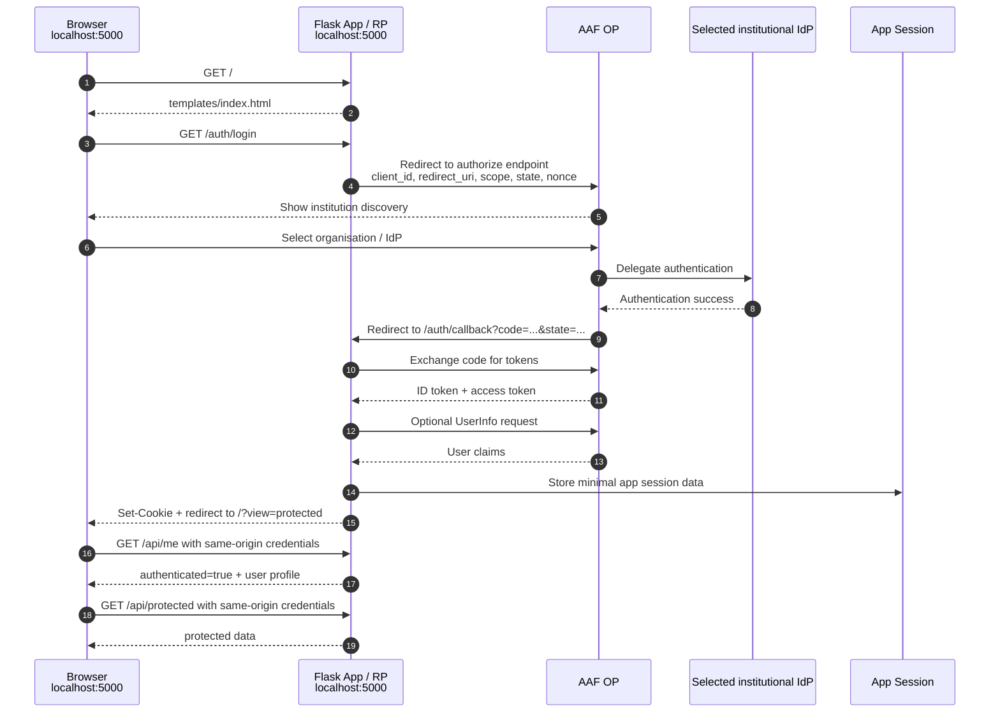

# AAF OIDC Authentication and Session Notes

## Purpose

AAF OpenID Connect authenticates the user through their institution. The application still needs its own session strategy so APIs can recognise future requests from the same browser.

This note separates those two concerns:

```text
1. Federated login: AAF OIDC proves who the user is.
2. Application session: the app remembers that this browser is logged in.
```

## Recommendation

For the local demo:

- Use AAF OIDC Authorization Code Flow.
- Keep the backend as the OIDC Relying Party.
- Keep the AAF client secret and AAF tokens out of frontend code.
- Create an application session after the backend callback succeeds.
- Send the browser an HttpOnly session cookie.
- Serve the demo HTML and APIs from the same Flask origin.
- Have frontend API calls use relative paths with `credentials: "same-origin"`.
- Treat `/?view=protected` as a UI view hint only, not authentication state.
- Keep the frontend small: one `templates/index.html`, CDN Bootstrap, and inline JavaScript are fine for the demo.

For production:

- Keep the same backend-owned OIDC flow.
- Prefer a server-side session store where the browser cookie contains only a session ID.
- Store only the minimum user claims needed by the application.
- Use secure HttpOnly cookies over HTTPS.
- Add CSRF protection for state-changing endpoints.
- Store secrets in a managed secret store.
- Bundle frontend dependencies or pin CDN assets with integrity controls.
- If frontend and API are split across origins later, add explicit CORS and switch API calls back to `credentials: "include"`.

## Local Demo Flow



## Frontend Responsibilities

The frontend should stay intentionally simple:

- show the login button
- redirect the browser to `/auth/login`
- switch to the protected view when the URL contains `?view=protected`
- call `/api/me` and `/api/protected` with `credentials: "same-origin"`
- display returned claims for the demo
- call `/auth/logout` when logging out

The frontend should not:

- store AAF access tokens, ID tokens, refresh tokens, or the client secret
- handle the OIDC callback
- decide that a user is authenticated because `?view=protected` is present
- store application JWTs in `localStorage` unless a later design explicitly accepts that risk

## Backend Responsibilities

The backend should:

- start the OIDC authorization request
- handle the callback
- exchange the authorization code for tokens
- validate tokens through the OIDC library and provider metadata
- read user claims from the ID token or UserInfo endpoint
- create the local application session
- redirect success to `/?view=protected`
- redirect failure to `/?error=login_failed`
- require a valid session before returning protected API data

## Session Data

Store the minimum useful user data, for example:

```json
{
  "sub": "stable-user-id-from-aaf",
  "name": "User Name",
  "email": "user@example.edu",
  "preferred_username": "username"
}
```

The current demo also stores and displays `raw_claims` so developers can see what AAF returned. That is useful for learning and debugging, but it should be removed or reduced before production.

Do not store AAF access tokens, ID tokens, refresh tokens, large claim blobs, or sensitive attributes in a client-readable session cookie.

## Session Options

### Option A: Flask Session Cookie

This is the smallest local proof-of-concept option. Flask signs the cookie, but does not encrypt it.

Good for:

- local demo
- quick explanation
- no database or Redis setup

Limitations:

- framework-specific
- cookie contents can be inspected by the browser
- not suitable for sensitive data or large claims
- harder to revoke centrally than a server-side session

Local settings:

```python
app.config.update(
    SESSION_COOKIE_HTTPONLY=True,
    SESSION_COOKIE_SAMESITE="Lax",
    SESSION_COOKIE_SECURE=False,  # local HTTP only
)
```

HTTPS settings:

```python
app.config.update(
    SESSION_COOKIE_HTTPONLY=True,
    SESSION_COOKIE_SAMESITE="Lax",
    SESSION_COOKIE_SECURE=True,
)
```

### Option B: Server-Side Session Store

This is the preferred production direction. The browser cookie contains only a session ID, while session data lives in a backend-managed store such as a database, Redis, DynamoDB, or the framework session table.

Good for:

- production apps
- session revocation
- central session expiry
- larger user or permission data
- keeping browser cookies small and less revealing

Production sessions should include:

- idle timeout
- absolute expiry
- logout revocation
- session ID rotation after login
- audit logging appropriate to the application

### Option C: App JWT

The backend can issue its own application JWT after AAF login, but this adds complexity.

Use caution because:

- revocation before expiry is harder
- `localStorage` token storage increases XSS impact
- CSRF still matters if the JWT is stored in a cookie
- every API must validate issuer, audience, signature, and expiry

This is not recommended for the first demo. If used later, prefer short-lived tokens and HttpOnly secure cookies over browser storage.

## Cookie and CSRF Checklist

For local development:

| Setting | Value |
|---|---|
| `HttpOnly` | `True` |
| `Secure` | `False` for localhost HTTP |
| `SameSite` | `Lax` |
| `Path` | `/` |
| `Domain` | omit for host-only cookie |

For production HTTPS:

| Setting | Value |
|---|---|
| `HttpOnly` | `True` |
| `Secure` | `True` |
| `SameSite` | `Lax` or stricter where compatible |
| `Path` | `/` |
| `Domain` | omit unless required |
| Lifetime | explicit idle and absolute expiry |

If cookies authenticate browser requests, add CSRF protection for state-changing endpoints. For production, prefer framework CSRF middleware, POST-only logout, and `Origin` or `Referer` validation for sensitive operations.

## Secret Management

Local demo:

```text
.env
```

Production:

```text
Managed secret store
```

Sensitive values include:

- AAF client secret
- framework session secret
- database credentials
- session store credentials

Generate a local Flask secret with:

```bash
uv run python -c "import secrets; print(secrets.token_urlsafe(32))"
```

Do not commit `.env`.

## Avoid

- storing AAF tokens in browser storage
- putting the AAF client secret in frontend code
- treating `?view=protected` as proof of login
- committing `.env`
- using weak session secrets
- using `SESSION_COOKIE_SECURE=True` on localhost HTTP
- storing full raw OIDC claims in production sessions
- using Flask's client-side session cookie for sensitive production session data
- relying on in-memory session state in horizontally scaled or serverless deployments
- using third-party CDN assets in production without pinning, integrity checks, or an asset ownership plan

## References

- OWASP Session Management Cheat Sheet: https://cheatsheetseries.owasp.org/cheatsheets/Session_Management_Cheat_Sheet.html
- OWASP CSRF Prevention Cheat Sheet: https://cheatsheetseries.owasp.org/cheatsheets/Cross-Site_Request_Forgery_Prevention_Cheat_Sheet.html
- Flask session cookie settings: https://flask.palletsprojects.com/en/stable/config/
- Flask cookie security: https://flask.palletsprojects.com/en/stable/web-security/
- Django session framework: https://docs.djangoproject.com/en/stable/topics/http/sessions/
- Subresource Integrity: https://developer.mozilla.org/en-US/docs/Web/Security/Subresource_Integrity
